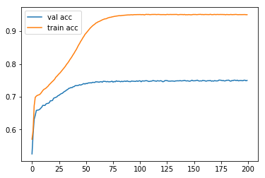
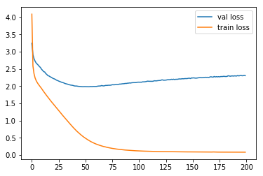
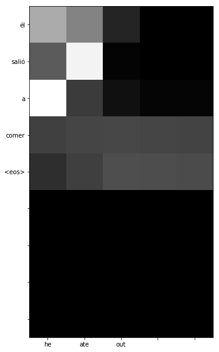
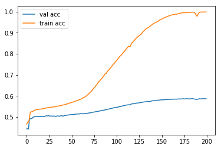

# Advanced_language_models
Seq2Seq, Memory and Attention

##Seq2Seq

Seq2Seq is a Neural Network architecture that allows inputs and outputs
to have different lengths. In particular it is useful for translation.

For this task the data was obtained at http://www.manythings.org/anki/ where
the user can choose any file he wants. These files contain sentences translated from
english to the language the user selects.

A common architecture is as follows:

english_sentence --> sequence --> encoder -> decoder --> unsequence --> spanish sentence

The encoder is an RNN with fixed length were we input an english sequence. To
handle sequences with variable lengths it is necesary to use padding previously.

    #Encoder
    encoder_input = Input([MAX_ENCODER_LENGTH,])
    embedded_input = encoder_embeddings(encoder_input)
    encoder_lstm = LSTM(LATENT_DIM, return_state = True)
    __, h_encoder, c_encoder = encoder_lstm(embedded_input)

During training we use a special trick called Teacher Forcing in which not only 
do we indicate the correct answer at the output of the RNN cell, but also at the input. This
accelerates learning.

    #Decoder
    #We use the decoder_input for teaching.
    decoder_input = Input([MAX_DECODER_LENGTH,])
    embedded_decoder_input = decoder_embeddings(decoder_input) #(batch_size, max_sequence_length, embedding_size)
    decoder_lstm = LSTM(LATENT_DIM, return_state = True, return_sequences = True)
    decoder_output, h_decoder, c_decoder = decoder_lstm(embedded_decoder_input, initial_state = [h_encoder, c_encoder])
    dense = Dense(MAX_DECODER_WORDS, activation = 'softmax')
    output = dense(decoder_output)
    
To translate new sentences we must be careful of the decoder output because previously we didn't connect the output of a cell to its
input for the next timestep. So we create another model reusing the weights learned during
training.

First, we use the encoder as normal and obtain the hidden state:

    #During prediction, use the decoder to output the hidden state.
    encoder_prediction_model = Model(inputs = [encoder_input], outputs = [h_encoder, c_encoder])

Second, we create an RNN of length one reusing the decoder learned previously.

    #Once we get the hidden state, pass it to the decoder that along the decoder input will output word indexes.
    input_decoder2 = Input([1, ])
    input_h = Input([LATENT_DIM, ])
    input_c = Input([LATENT_DIM, ])
    embedded_decoder_input2 = decoder_embeddings(input_decoder2)
    o2, h2, c2 = decoder_lstm(embedded_decoder_input2, initial_state=[input_h, input_c])
    outputs2 = dense(o2)
    decoder_prediction_model = Model(inputs = [input_decoder2, input_h, input_c], outputs = [outputs2, h2, c2])
    
Finally use a loop to get the current word prediction and feeding it back to the cell along with
the updated hidden state to get the next word prediction.

    for i in range(MAX_SEQUENCE_LENGTH):
        probs, h_s, c_s = decoder_prediction_model.predict([decoder_input_, h_s, c_s])
        #Do not take into account the first column.
        word_idx = np.argmax(probs[0, 0, 1:]) + 1
        word = decoder_index2word[word_idx]
        #If end of sentence token, break;
        if word == '<eos>':
            break;
        
        decoder_input_[0, 0] = word_idx;
        decoder_sentence.append(word)
        
For the loss function we used categorical cross-entropy where we had to hot encode the targets 
(One hot encoding consumes a lot of memory, that's why we couldn't train on large sentences). 
After training during 100 epochs we tested the model.

    English sentence: It was fabulous. 
    Spanish translation: estaba fabuloso.
    
    English sentence: Call me. 
    Spanish translation: llamadme.
    
    English sentence: Are you mad? 
    Spanish translation: ¿estás loco?
    
    English sentence: What's the plan? 
    Spanish translation: ¿cuál es el plan?
    
    English sentence: I need answers. 
    Spanish translation: necesito respuestas.
    
We got pretty good results. However, due to memory limitations the model was trained
only with short sentences (0-10 words).

## Attention network.

We improve teh seq2seq model by adding attention. In the Seq2seq model, the output of the encoder is also the hidden state of the last LSTM/GRU unit.
For last sentences, this hidden state can't hold enough information for the decoder.

In attention networks we use a weighted combination of the output of LTMS/GRU units in the encoder bidirectional layer.
That means that for predicting the next word during the decoder phase we consider the whole input sentence.

The weights are in turn calculated using a neural network.

alpha_t' = Network([s_t-1, h_t']), t' = 1...Tx

Where s_t-1 is the previous state of the decoder LSTM/GRU. h_t' is the t' output of the encoder bidirectional layer.
alpha_t' is the weight that corresponds to the input word at time t.

The accuracy improved in comparison with the basic seq2seq model.

The loss also got lower.

We can even create an attention matrix where it is possible to observe each word
that the network was paying attention to when generating each output word.

Let's test some translations from the same training dataset:

    Continue? y/ny
    Original: I'm a liar.
    Translation: soy un mentiroso <eos>
    Continue? y/ny
    Original: I'm hungry.
    Translation: me pica el bagre <eos>
    Continue? y/ny
    Original: That's not true.
    Translation: no es verdad <eos>
    Continue? y/ny
    Original: That's a lot!
    Translation: ¡es un montón! <eos>
    Continue? y/ny
    Original: He is old.
    Translation: él es anciano <eos>

At this point it is pausible to construct a chatbot. Instead
of using original_sentence -> translation_sentence pairs
would need input and output pairs from real conversations:

I used a corpus consisting of twitter conversation and converted into 
a format of input --> tab --> output lines. Then using a loop asking for
new sentences we can simulate a chat.

    Write a sentence ('n' to exit):hey mate
    Original: hey mate
    Translation: im sorry for im scared <eos>
    Write a sentence ('n' to exit):when are you comming home?
    Original: when are you comming home?
    Translation: i'm trying, this shit though i'm done too year <eos>
    Write a sentence ('n' to exit):why?
    Original: why?
    Translation: they feeeeeeeel iiiiiiiiittt <eos>
    Write a sentence ('n' to exit):everything will be ok
    Original: everything will be ok
    Translation: what i'm true <eos>
    
The conversation we got has some sense, but mostly we got some random answers.
That is because we are not entering sentences from the training set but from the 
validation set. If we observe the training curve we will realize that the model
overfitted and only learned to memorize.

To construct a chatbot is a hard task regarding generating a meaninful conversation chain.
Some reasons for this is:
a) For one sentence we could get multiple valid answers and we didn't include them in the training set. 
b) Our model doesn't manage the previous state of the chat. That means that each time
   we insert a new sentence we'll likely get an answer that doesn't follow the
   previous conversation.

!