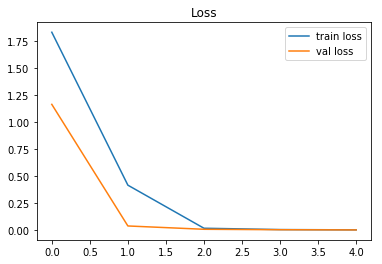
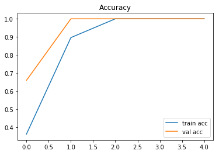
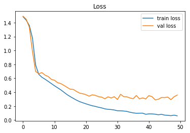
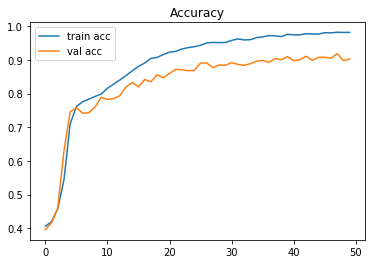

# Advanced_language_models
Seq2Seq, Memory and Attention

##Seq2Seq

Seq2Seq is a Neural Network architecture that allows inputs and outputs
to have different lengths. In particular it is useful for translation.

For this task the data was obtained at http://www.manythings.org/anki/ where
the user can choose any file he wants. These files contain sentences translated from
english to the language the user selects.

A common architecture is as follows:

english_sentence --> sequence --> encoder -> decoder --> unsequence --> spanish sentence

The encoder is an RNN with fixed length were we input an english sequence. To
handle sequences with variable lengths it is necesary to use padding previously.

    #Encoder
    encoder_input = Input([MAX_ENCODER_LENGTH,])
    embedded_input = encoder_embeddings(encoder_input)
    encoder_lstm = LSTM(LATENT_DIM, return_state = True)
    __, h_encoder, c_encoder = encoder_lstm(embedded_input)

During training we use a special trick called Teacher Forcing in which not only 
do we indicate the correct answer at the output of the RNN cell, but also at the input. This
accelerates learning.

    #Decoder
    #We use the decoder_input for teaching.
    decoder_input = Input([MAX_DECODER_LENGTH,])
    embedded_decoder_input = decoder_embeddings(decoder_input) #(batch_size, max_sequence_length, embedding_size)
    decoder_lstm = LSTM(LATENT_DIM, return_state = True, return_sequences = True)
    decoder_output, h_decoder, c_decoder = decoder_lstm(embedded_decoder_input, initial_state = [h_encoder, c_encoder])
    dense = Dense(MAX_DECODER_WORDS, activation = 'softmax')
    output = dense(decoder_output)
    
To translate new sentences we must be careful of the decoder output because previously we didn't connect the output of a cell to its
input for the next timestep. So we create another model reusing the weights learned during
training.

First, we use the encoder as normal and obtain the hidden state:

    #During prediction, use the decoder to output the hidden state.
    encoder_prediction_model = Model(inputs = [encoder_input], outputs = [h_encoder, c_encoder])

Second, we create an RNN of length one reusing the decoder learned previously.

    #Once we get the hidden state, pass it to the decoder that along the decoder input will output word indexes.
    input_decoder2 = Input([1, ])
    input_h = Input([LATENT_DIM, ])
    input_c = Input([LATENT_DIM, ])
    embedded_decoder_input2 = decoder_embeddings(input_decoder2)
    o2, h2, c2 = decoder_lstm(embedded_decoder_input2, initial_state=[input_h, input_c])
    outputs2 = dense(o2)
    decoder_prediction_model = Model(inputs = [input_decoder2, input_h, input_c], outputs = [outputs2, h2, c2])
    
Finally use a loop to get the current word prediction and feeding it back to the cell along with
the updated hidden state to get the next word prediction.

    for i in range(MAX_SEQUENCE_LENGTH):
        probs, h_s, c_s = decoder_prediction_model.predict([decoder_input_, h_s, c_s])
        #Do not take into account the first column.
        word_idx = np.argmax(probs[0, 0, 1:]) + 1
        word = decoder_index2word[word_idx]
        #If end of sentence token, break;
        if word == '<eos>':
            break;
        
        decoder_input_[0, 0] = word_idx;
        decoder_sentence.append(word)
        
For the loss function we used categorical cross-entropy where we had to hot encode the targets 
(One hot encoding consumes a lot of memory, that's why we couldn't train on large sentences). 
After training during 100 epochs we tested the model.

    English sentence: It was fabulous. 
    Spanish translation: estaba fabuloso.
    
    English sentence: Call me. 
    Spanish translation: llamadme.
    
    English sentence: Are you mad? 
    Spanish translation: ¿estás loco?
    
    English sentence: What's the plan? 
    Spanish translation: ¿cuál es el plan?
    
    English sentence: I need answers. 
    Spanish translation: necesito respuestas.
    
We got pretty good results. However, due to memory limitations the model was trained
only with short sentences (0-10 words).

## Attention network.

We improve teh seq2seq model by adding attention. In the Seq2seq model, the output of the encoder is also the hidden state of the last LSTM/GRU unit.
For last sentences, this hidden state can't hold enough information for the decoder.

In attention networks we use a weighted combination of the output of LTMS/GRU units in the encoder bidirectional layer.
That means that for predicting the next word during the decoder phase we consider the whole input sentence.

The weights are in turn calculated using a neural network.

alpha_t' = Network([s_t-1, h_t']), t' = 1...Tx

Where s_t-1 is the previous state of the decoder LSTM/GRU. h_t' is the t' output of the encoder bidirectional layer.
alpha_t' is the weight that corresponds to the input word at time t.

The accuracy improved in comparison with the basic seq2seq model.

The loss also got lower.

We can even create an attention matrix where it is possible to observe each word
that the network was paying attention to when generating each output word.

Let's test some translations from the same training dataset:

    Continue? y/ny
    Original: I'm a liar.
    Translation: soy un mentiroso <eos>
    Continue? y/ny
    Original: I'm hungry.
    Translation: me pica el bagre <eos>
    Continue? y/ny
    Original: That's not true.
    Translation: no es verdad <eos>
    Continue? y/ny
    Original: That's a lot!
    Translation: ¡es un montón! <eos>
    Continue? y/ny
    Original: He is old.
    Translation: él es anciano <eos>

At this point it is pausible to construct a chatbot. Instead
of using original_sentence -> translation_sentence pairs
would need input and output pairs from real conversations:

I used a corpus consisting of twitter conversation and converted into 
a format of input --> tab --> output lines. Then using a loop asking for
new sentences we can simulate a chat.

    Write a sentence ('n' to exit):hey mate
    Original: hey mate
    Translation: im sorry for im scared <eos>
    Write a sentence ('n' to exit):when are you comming home?
    Original: when are you comming home?
    Translation: i'm trying, this shit though i'm done too year <eos>
    Write a sentence ('n' to exit):why?
    Original: why?
    Translation: they feeeeeeeel iiiiiiiiittt <eos>
    Write a sentence ('n' to exit):everything will be ok
    Original: everything will be ok
    Translation: what i'm true <eos>
    
The conversation we got has some sense, but mostly we got some random answers.
That is because we are not entering sentences from the training set but from the 
validation set. If we observe the training curve we will realize that the model
overfitted and only learned to memorize.

To construct a chatbot is a hard task regarding generating a meaninful conversation chain.
Some reasons for this is:
a) For one sentence we could get multiple valid answers and we didn't include them in the training set. 
b) Our model doesn't manage the previous state of the chat. That means that each time
   we insert a new sentence we'll likely get an answer that doesn't follow the
   previous conversation.

##Memory networks

Memory networks is a relatively new architecture that tackles problems related to long term
dependencies in sequential data. 

In memory networks the input data consists of:
a) A story.
b) Each story is made up of several sentences. 
c) Each sentence contains many words.
d) A query that contains many words.
e) An answer made up of one word.

The objective is to input a story, input a query and retrieve an answer.

In this study case we analyse two tasks:

a) One supporting fact model to solve question answering based on one
   sentences in the story that supports the answer.
b) Two supporting facts model to solve question answering based on two
   sentences in the story that supports the answer.

In memory networks we feed the complete story into the network. First we divide
the story in sentences. Each sentence contains words that we pass into an embedding layer.
Next, we sum the embedded representations of the words in the sentence and create
and "embedded sentence". We end up with T sentences in word vector format.

    EMBEDDING_DIM = 15
    input_facts = Input(shape=(MAX_STORY_LENGTH, MAX_FACT_LENGTH))
    embeddings = Embedding(MAX_VOCABULARY, EMBEDDING_DIM)
    sentences_op = embeddings(input_facts)
    sentences_op = Lambda(lambda x: K.sum(x, axis = 2))(sentences_op)

Next the network processes the query. As with the sentences, an embedding layer transformes its words 
into word vectors with the same latent dimensionality as the embedded sentences.

    input_question = Input(shape=(MAX_QUESTION_LENGTH, ))
    embeddings_question = Embedding(MAX_VOCABULARY, EMBEDDING_DIM)
    question_op = embeddings_question(input_question)
    question_op = Lambda(lambda x: K.sum(x, axis = 1))(question_op)
    question_op = Reshape((1, EMBEDDING_DIM))(question_op)
    
The network needs to compute the importance of each sentence to answer the query.
To do so it calculates the dot product between the sentences and the query and return scores. This is
trivial as ach sentence and the query have the same latent dimensionality.
    
    weights = Dot(axes = 2)([sentences_op, question_op])
    weights = Reshape((MAX_STORY_LENGTH,))(weights) #We can use flatten as well but this way we can control the output dimension.
    weights = Activation(activation = "softmax")(weights)
    weights = Reshape((MAX_STORY_LENGTH, 1))(weights)

The next step is to create a weighted sum of the story sentences using the scores computed
previously. 

    s_relevant = Dot(axes = 1)([sentences_op, weights])
    s_relevant = Reshape((EMBEDDING_DIM, ))(s_relevant)

The previous steps are ensembled into what is called a hop.

In the case of the one supporting fact task we finish the model by adding to the hop a dense layer with
a softmax activation function. The output size is equal to the vocabulary length and the network
will pick the most probable word as the answer given the input sentences and the query.

    output = Dense(MAX_VOCABULARY, activation = "softmax")(s_relevant)

For the two supporting fact task the first hop will take care of choosing the first fact.
Additionally we create another hop to handle the second supporting fact. The output of the first
hop will serve as the embedded question for the second hop. Examining carefully we can notice
that we are effectively communicating both hops using a recurrent conexion. We added then
a recurrent element that we can utilize to create models with more than two supporting factors.

Optionally, in order to optimize the two supporting factor model:
1) Inside each hop we create two sentence embeddings instead of only one.
   The first one will be used to calculate the sentence weights (scores) and the second
   one will be used to multipy the weights by later.
   
       embeddings_story_1 , weights_1, output_1 = hop(embeddings_story, 
                                                   embeddings_question, 
                                                   dense_layer, 
                                                   MAX_VOCABULARY, 
                                                   EMBEDDING_DIM, 
                                                   MAX_STORY_LENGTH)
   
2) Pass the second sencence embedding from the first hop to the second hop to create its
   weights.
   
        embeddings_story_2 , weights_2, output_2 = hop(embeddings_story_1, 
                                                   output_1,
                                                   dense_layer, 
                                                   MAX_VOCABULARY, 
                                                   EMBEDDING_DIM, 
                                                   MAX_STORY_LENGTH)
   
        output_softmax = Dense(MAX_VOCABULARY, activation = "softmax")(output_2)

Results of the single supporting fact model/task:

As we can see this task require only a few epochs to train and as it is not deep it was quite fast as well.

We can even print the weights assigned to each sentence during the calculation of the dot product
between the story and the query.

    Question:  Where is Sandra ? Correct: kitchen Prediction: kitchen
    Story: 
    1 Mary journeyed to the bedroom . 
			0.00
    2 Sandra travelled to the kitchen . 
			1.00
    
 
 
 
 
 
 
 
			        0.00
    
 
 
 
 
 
 
 
			        0.00
    
 
 
 
 
 
 
 
			        0.00
    
 
 
 
 
 
 
 
			        0.00
    
 
 
 
 
 
 
 
			        0.00
    
 
 
 
 
 
 
 
			        0.00
    
 
 
 
 
 
 
 
			        0.00
    
 
 
 
 
 
 
 
			        0.00
    Continue y/nn

The hop chooses the sentence 2 (Sandra travelled to the kitchen) to answer the question, where is Sandra? Answer: Kitchen.

Results of the two supporting fact model/task:

This task take more epochs to have a decent performance. It was slower to trein at each epoch as well.

Again we can print the weights that each hop assigns to the story sentences.

    Question:  Where is the apple ? Answer: office Prediction: office
    Story: 
    1 Sandra went back to the garden .			0.0000		0.0000
    2 Mary journeyed to the kitchen . 
			0.0000		0.0000
    3 Sandra travelled to the office . 
			0.0000		0.0000
    4 John went back to the office .			0.0000		0.0000
    5 Sandra went to the bathroom . 
			0.0000		0.0000
    6 Sandra went back to the garden .			0.0000		0.0000
    7 Daniel went back to the office .			0.0000		0.0000
    8 John moved to the hallway . 
			0.0000		0.0000
    9 Mary grabbed the milk there . 
			0.0000		0.0000
    10 Mary left the milk . 
 
			        0.0000		0.0000
    12 Mary travelled to the garden . 
			0.0000		0.0045
    13 Sandra took the apple there . 
			0.0011		0.0000
    15 Sandra left the apple there . 
			0.0202		0.0000
    16 Mary got the football there . 
			0.0000		0.0000
    18 Mary grabbed the apple there . 
			0.9787		0.0000
    19 Mary discarded the football . 
 
		0.0000		0.0000
    21 Sandra picked up the football there .		0.0000		0.0000
    22 Mary travelled to the office . 
			0.0000		0.9955
    
 
 
 
 
 
 
 
			        0.0000		0.0000
    
 
 
 
 
 
 
 
			        0.0000		0.0000
    
 
 
 
 
 
 
 
			        0.0000		0.0000
    
 
 
 
 
 
 
 
			        0.0000		0.0000
    
The first hop picks the sentence 18 and the second hop the sentence 22.

18 Mary grabbed the apple there.
22 Mary travelled to the office.

These sentence are actually the two supporting facts to answer the question, where is the apple? Answer: Office